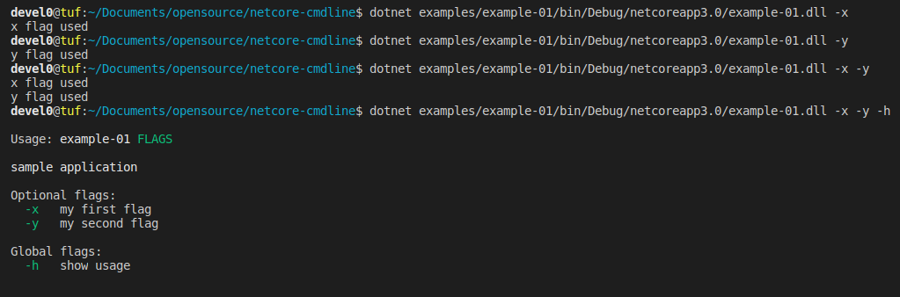

# netcore-cmdline

[](https://www.nuget.org/packages/netcore-cmdline/)

.NET core command line parser

<hr/>

- [Features](#features)
- [Quickstart](#quickstart)
  - [Basic flags](#basic-flags)
- [API Documentation](#api-documentation)
- [how this project was built](#how-this-project-was-built)

<hr/>

## Features

- multi level nested command parsers
- mandatory/optional short/long flags with/without value ; global flags
- parameter and array of parameters
- automatic standard usage ( color supported )
- automatic bash completions

## Quickstart

- [nuget package](https://www.nuget.org/packages/netcore-cmdline/)

### Basic flags

```csharp
using SearchAThing;

namespace example_01
{
    class Program
    {
        static void Main(string[] args)
        {
            // create main parser
            CmdlineParser.Create("sample application", (parser) =>
            {
                var xflag = parser.AddShort("x", "my first flag");
                var yflag = parser.AddShort("y", "my second flag");                

                // global flag with auto invoked action when matches that print usage for nested MatchParser
                parser.AddShort("h", "show usage", null, (item) => item.MatchParser.PrintUsage());

                // entrypoint for parser level cmdline match
                parser.OnCmdlineMatch(() =>
                {
                    if (xflag) System.Console.WriteLine($"x flag used");
                    if (yflag) System.Console.WriteLine($"y flag used");
                });

                // call this once at toplevel parser only
                parser.Run(args);
            });
        }
    }
}
```



### Flags with value

```csharp
using SearchAThing;

namespace example_01
{
    class Program
    {
        static void Main(string[] args)
        {
            CmdlineParser.Create("sample application", (parser) =>
            {
                var xflag = parser.AddShort("x", "my first flag", "XVAL");
                var yflag = parser.AddShort("y", "my second flag", "YVAL");
                var vflag = parser.AddShortLong("v", "value", "a value flag", "VAL");

                parser.AddShort("h", "show usage", null, (item) => item.MatchParser.PrintUsage());

                parser.OnCmdlineMatch(() =>
                {
                    if (xflag) System.Console.WriteLine($"x flag used [{(string)xflag}]");
                    if (yflag) System.Console.WriteLine($"y flag used [{(string)yflag}]");
                    if (vflag) System.Console.WriteLine($"value specified [{(string)vflag}]");
                });

                parser.Run(args);
            });
        }
    }
}
```

```sh
devel0@tuf:~/tmp/example-01$ dotnet example-01.dll -h

Usage: example-01 FLAGS

sample application

Optional flags:
  -x=XVAL          my first flag
  -y=YVAL          my second flag
  -v,--value=VAL   a value flag

Global flags:
  -h               show usage


devel0@tuf:~/tmp/example-01$ dotnet example-01.dll -x 1 -y 2 -v 3
x flag used [1]
y flag used [2]
value specified [3]
devel0@tuf:~/tmp/example-01$ dotnet example-01.dll -x 1 -y 2 --value 3
x flag used [1]
y flag used [2]
value specified [3]
devel0@tuf:~/tmp/example-01$ dotnet example-01.dll -x 1 -y 2 -v=3
x flag used [1]
y flag used [2]
value specified [3]
devel0@tuf:~/tmp/example-01$ dotnet example-01.dll -x 1 -y 2 --value=3
x flag used [1]
y flag used [2]
value specified [3]
```

## API Documentation

- [CmdlineParser](doc/api/SearchAThing/CmdlineParser.md)
- [CmdlineParseItem](doc/api/SearchAThing/CmdlineParseItem.md)
- [CmdlineUsage](doc/api/SearchAThing/CmdlineUsage.md)
- [CmdlineColors](doc/api/SearchAThing/CmdlineColors.md)
- [CmdlineArgument](doc/api/SearchAThing/CmdlineArgument.md)
- [CmdlineParseItemType](doc/api/SearchAThing/CmdlineParseItemType.md)

## how this project was built

```sh
mkdir netcore-cmdline
cd netcore-cmdline

dotnet new sln

dotnet new classlib -n netcore-cmdline
cd netcore-cmdline
dotnet add package netcore-util --version 1.0.14
cd ..
dotnet sln add netcore-cmdline

mkdir examples
cd examples
dotnet new console -n example-01
cd example-01
dotnet add reference ../../netcore-cmdline
cd ..
cd ..
dotnet sln add examples/example-01

dotnet restore
dotnet build
```
