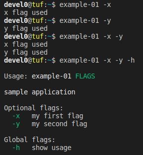

# netcore-cmdline

[](https://www.nuget.org/packages/netcore-cmdline/)

.NET core command line parser

<hr/>

- [Features](#features)
- [Quickstart](#quickstart)
  - [Basic flags](#basic-flags)
  - [Flags with value](#flags-with-value)
  - [Parameters](#parameters)
  - [Parameters array](#parameters-array)
  - [Bash Completion](#bash-completion)
  - [Sub parser](#sub-parser)
- [API Documentation](#api-documentation)
- [how this project was built](#how-this-project-was-built)

<hr/>

## Features

- multi level nested command parsers
- mandatory/optional short/long flags with/without value ; global flags
- parameter and array of parameters
- automatic standard usage ( color supported )
- automatic bash completions

## Quickstart

- [nuget package](https://www.nuget.org/packages/netcore-cmdline/)

### Basic flags

> to execute `example-01` from command line can set path with something like `export PATH=$PATH:~/opensource/netcore-cmdline/examples/example-01/bin/Debug/netcoreapp3.0`

```csharp
using SearchAThing;

namespace example_01
{
    class Program
    {
        static void Main(string[] args)
        {
            // create main parser
            CmdlineParser.Create("sample application", (parser) =>
            {
                var xflag = parser.AddShort("x", "my first flag");
                var yflag = parser.AddShort("y", "my second flag");                

                // global flag with auto invoked action when matches that print usage for nested MatchParser
                parser.AddShort("h", "show usage", null, (item) => item.MatchParser.PrintUsage());

                // entrypoint for parser level cmdline match
                parser.OnCmdlineMatch(() =>
                {
                    if (xflag) System.Console.WriteLine($"x flag used");
                    if (yflag) System.Console.WriteLine($"y flag used");
                });

                // call this once at toplevel parser only
                parser.Run(args);
            });
        }
    }
}
```



### Flags with value

```csharp
using SearchAThing;

namespace example_01
{
    class Program
    {
        static void Main(string[] args)
        {
            CmdlineParser.Create("sample application", (parser) =>
            {
                var xflag = parser.AddShort("x", "my first flag", "XVAL");
                var yflag = parser.AddShort("y", "my second flag", "YVAL");
                var vflag = parser.AddShortLong("v", "value", "a value flag", "VAL");

                parser.AddShort("h", "show usage", null, (item) => item.MatchParser.PrintUsage());

                parser.OnCmdlineMatch(() =>
                {
                    if (xflag) System.Console.WriteLine($"x flag used [{(string)xflag}]");
                    if (yflag) System.Console.WriteLine($"y flag used [{(string)yflag}]");
                    if (vflag) System.Console.WriteLine($"value specified [{(string)vflag}]");
                });

                parser.Run(args);
            });
        }
    }
}
```

```sh
devel0@tuf:~$ example-01 -h

Usage: example-01 FLAGS

sample application

Optional flags:
  -x=XVAL          my first flag
  -y=YVAL          my second flag
  -v,--value=VAL   a value flag

Global flags:
  -h               show usage


devel0@tuf:~$ example-01 -x 1 -y 2 -v 3
x flag used [1]
y flag used [2]
value specified [3]
devel0@tuf:~$ example-01 -x 1 -y 2 --value 3
x flag used [1]
y flag used [2]
value specified [3]
devel0@tuf:~$ example-01 -x 1 -y 2 -v=3
x flag used [1]
y flag used [2]
value specified [3]
devel0@tuf:~$ example-01 -x 1 -y 2 --value=3
x flag used [1]
y flag used [2]
value specified [3]
```

### Parameters

```csharp
using SearchAThing;

namespace example_01
{
    class Program
    {
        static void Main(string[] args)
        {
            CmdlineParser.Create("sample application", (parser) =>
            {
                var xflag = parser.AddShort("x", "test flag");
                var param1 = parser.AddParameter("param1", "first parameter");
                var param2 = parser.AddParameter("param2", "second parameter");

                parser.AddShort("h", "show usage", null, (item) => item.MatchParser.PrintUsage());

                parser.OnCmdlineMatch(() =>
                {
                    System.Console.WriteLine(parser);
                });

                parser.Run(args);
            });
        }
    }
}
```

```sh
devel0@tuf:~$ example-01 -x a bcd
TYPE        SHORT-NAME   LONG-NAME   DESCRIPTION        GLOBAL   MANDATORY   MATCHES   VALUE
--------------------------------------------------------------------------------------------
flag        x                        test flag                                  X           
flag        h                        show usage           X                                 
parameter   param1                   first parameter                            X      a    
parameter   param2                   second parameter                           X      bcd  

```

### Parameters array

```csharp
using SearchAThing;
using System.Linq;

namespace example_01
{
    class Program
    {
        static void Main(string[] args)
        {
            CmdlineParser.Create("sample application", (parser) =>
            {
                var xflag = parser.AddShort("x", "test flag");
                var param1 = parser.AddParameter("param1", "first parameter");
                var param2 = parser.AddParameterArray("param2", "other params");

                parser.AddShort("h", "show usage", null, (item) => item.MatchParser.PrintUsage());

                parser.OnCmdlineMatch(() =>
                {
                    System.Console.WriteLine($"param2 count = {param2.Count()}");
                    System.Console.WriteLine(parser);
                });

                parser.Run(args);
            });
        }
    }
}
```

```sh
devel0@tuf:~$ example-01 a
param2 count = 0
TYPE             SHORT-NAME   LONG-NAME   DESCRIPTION       GLOBAL   MANDATORY   MATCHES   VALUE
------------------------------------------------------------------------------------------------
flag             x                        test flag                                             
flag             h                        show usage          X                                 
parameter        param1                   first parameter                           X      a    
parameterArray   param2                   other params                                          

devel0@tuf:~$ example-01 a b c
param2 count = 2
TYPE             SHORT-NAME   LONG-NAME   DESCRIPTION       GLOBAL   MANDATORY   MATCHES   VALUE      
------------------------------------------------------------------------------------------------------
flag             x                        test flag                                                   
flag             h                        show usage          X                                       
parameter        param1                   first parameter                           X      a          
parameterArray   param2                   other params                              X      [ "b","c" ]

```

### Bash completion

```csharp
using SearchAThing;
using System.Linq;

namespace example_01
{
    class Program
    {
        static void Main(string[] args)
        {
            CmdlineParser.Create("sample application", (parser) =>
            {
                var cmd1 = parser.AddCommand("cmd1", "sample command 1");
                var cmd2 = parser.AddCommand("cmd2", "sample command 2");

                var flag1 = parser.AddShortLong("f1", "test-flag1", "sample flag 1");
                var flag2 = parser.AddShortLong("f2", "test-flag2", "sample flag 2");
                var flag3 = parser.AddShortLong("f3", "my-flag3", "sample flag 3");

                parser.AddShort("h", "show usage", null, (item) => item.MatchParser.PrintUsage());

                var param = parser.AddParameter("item", "an odd number between 51 and 63");
                param.OnCompletion((str) =>
                {
                    var validSet = Enumerable.Range(50, 15).Where(r => r % 2 != 0).Select(w => w.ToString());

                    return validSet.Where(r => r.StartsWith(str));
                });

                parser.OnCmdlineMatch(() =>
                {
                });

                parser.Run(args);
            });
        }
    }
}
```

- debugging

```sh
devel0@tuf:~$ SHOW_COMPLETIONS=1 example-01
cmd1
cmd2
devel0@tuf:~$ SHOW_COMPLETIONS=1 example-01 cmd2
51
53
55
57
59
61
63
devel0@tuf:~$ SHOW_COMPLETIONS=1 example-01 cmd2 5
51
53
55
57
59
devel0@tuf:~$ SHOW_COMPLETIONS=1 example-01 cmd2 6
61
63
devel0@tuf:~$ SHOW_COMPLETIONS=1 example-01 cmd2 63
devel0@tuf:~$
```

- apply to bash completions

edit `/etc/bash_completion.d/example-01` as follow

```sh
_fn() {
        #echo >> /tmp/completion-debug
        #echo "COMP_LINE=${COMP_LINE}" >> /tmp/completion-debug
        #SHOW_COMPLETIONS=1 example-01 ${COMP_LINE} >> /tmp/completion-debug

        COMPREPLY=($(SHOW_COMPLETIONS=1 example-01 ${COMP_LINE}))
}

complete -F _fn example-01
```

source it with `. /etc/bash_completion` then try as follows


### Sub parser

```csharp
using SearchAThing;

namespace example_01
{
    class Program
    {
        static void Main(string[] args)
        {
            CmdlineParser.Create("sample application", (parser) =>
            {
                var cmdConfig = parser.AddCommand("config", "configuration", (pConfig) =>
                {
                    var cmdConfigShow = pConfig.AddCommand("show", "show current config");
                    var cmdConfigUpdate = pConfig.AddCommand("update", "update config item", (pConfigUpdate) =>
                    {
                        var param = pConfigUpdate.AddMandatoryParameter("var=value", "assign value to var");
                        pConfigUpdate.OnCmdlineMatch(() =>
                        {
                            System.Console.WriteLine($"setting [{(string)param}]");
                        });
                    });

                    pConfig.OnCmdlineMatch(() =>
                    {
                        if (cmdConfigShow) System.Console.WriteLine($"showing configuration...");
                    });
                });                
                
                parser.AddShort("h", "show usage", null, (item) => item.MatchParser.PrintUsage());                

                parser.OnCmdlineMatch(() =>
                {
                });

                parser.Run(args);
            });
        }
    }
}
```


## API Documentation

- [CmdlineParser](doc/api/SearchAThing/CmdlineParser.md)
- [CmdlineParseItem](doc/api/SearchAThing/CmdlineParseItem.md)
- [CmdlineUsage](doc/api/SearchAThing/CmdlineUsage.md)
- [CmdlineColors](doc/api/SearchAThing/CmdlineColors.md)
- [CmdlineArgument](doc/api/SearchAThing/CmdlineArgument.md)
- [CmdlineParseItemType](doc/api/SearchAThing/CmdlineParseItemType.md)

## how this project was built

```sh
mkdir netcore-cmdline
cd netcore-cmdline

dotnet new sln

dotnet new classlib -n netcore-cmdline
cd netcore-cmdline
dotnet add package netcore-util --version 1.0.14
cd ..
dotnet sln add netcore-cmdline

mkdir examples
cd examples
dotnet new console -n example-01
cd example-01
dotnet add reference ../../netcore-cmdline
cd ..
cd ..
dotnet sln add examples/example-01

dotnet restore
dotnet build
```
